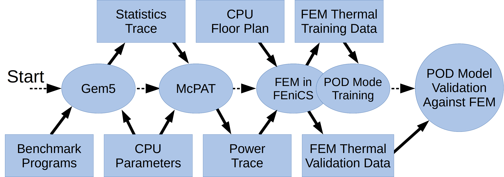
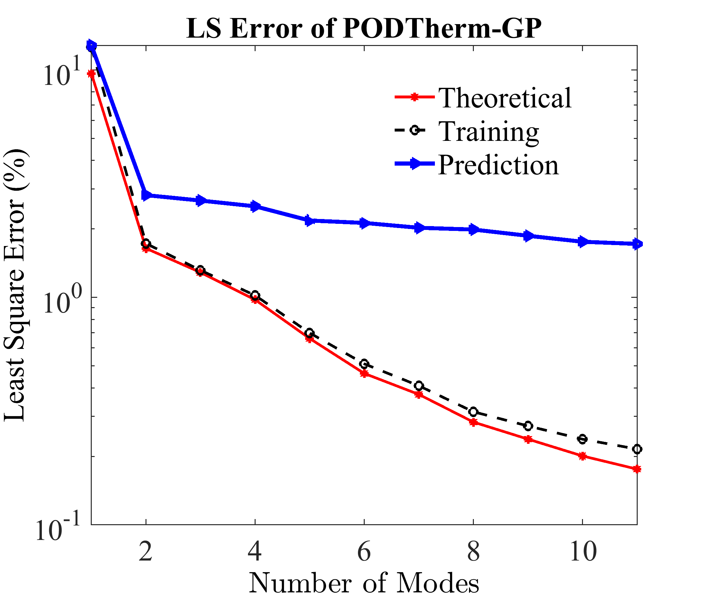

# Welcome to PODTherm-GP!
PODTherm-GP is a data-learning based thermal simulator without any assumptions, which can offer 3D dynamic thermal simulations of semiconductor chips accurately and efficiently. 
This `README.md` provides tutorial-like details on how to install and use PODTherm-GP. It can be further integrated into the performance-power-thermal simulation toolchains as a thermal model. If you use any component of PODTherm-GP, please cite:

```
[1] L. Jiang, Y. Liu and M. -C. Cheng, "Fast Accurate Full-Chip Dynamic Thermal Simulation with Fine Resolution Enabled by a Learning 
    Method," in IEEE Transactions on Computer-Aided Design of Integrated Circuits and Systems, doi: 10.1109/TCAD.2022.3229598.

[2] L. Jiang, A. Dowling, M. -C. Cheng and Y. Liu, "PODTherm-GP: A Physics-based Data-Driven Approach for Effective Architecture-Level Thermal Simulation of Multi-Core CPUs," in IEEE Transactions on Computers, doi: 10.1109/TC.2023.3278535.
```
# Overview
PODTherm-GP is enabled by the proper orthogonal decomposition (POD), which projects the physical domain of processors onto the POD space represented by a finite set of basis functions (also called POD modes). In addition, the physical principle is also incorporated into PODTherm-GP via the Galerkin projection (GP), which provides a physical guidance to thermal simulations. The results show that PODTherm-GP is able to offer dynamic temperature solutions efficiently and accurately within and beyond training range.  The whole workflow of this approach constitutes the training of PODTherm-GP and its demonstration as shown in the below figure where [Gem5](https://www.gem5.org/) and [McPAT](https://code.google.com/archive/p/mcpat/) are CPU and power simulators, respectively. The detailed information can be found in [ISCAS2022](https://ieeexplore.ieee.org/abstract/document/9937274).

<p align="center">
  
</pr>


PODTherm-GP includes several components and each C++ component can be compiled in its folder by the following  
```
    cd ./src  
    ffc -l dolfin Space.ufl  
    cd ..  
    mkdir build  
    cd ./build  
    cmake ..  
    make 
 ```
 Then the executable file can be run with one or multiple processes. For instance, the component of training data collection can be performed by 
 ```
 mpirun -n 20 ./Therm_FEM
 ```
where 20 is the number of processes. However, for this version PODTherm-GP, [ODE solver](https://github.com/CompResearchLab/PODTherm-GP/tree/main/ODE_Solver_CU) doesn't support MPI.   

# Dependencies
**FEniCS platform installation**:  
PODTherm-GP thermal simulator is developed on the FEniCS platform(version 2019.1.0), which provides a flexible framework for solving partial differential equations (PDEs) using finite element methods. FEniCS should be pre-installed using the following command:  
```
sudo apt-get install --no-install-recommends software-properties-common  
sudo add-apt-repository ppa:fenics-packages/fenics  
sudo apt-get update  
sudo apt-get install fenics
```
Please refer to the FEniCS installation guide for more detailed instructions on installation and troubleshooting: [FEniCS download](https://fenicsproject.org/download/.).

**Building tools installation**:   
To run the C++ version FEniCS, you need to make sure that the build tools are installed
```
sudo apt install cmake make g++ -y
```
**C++ FEniCS installation**:  
If the cmake are installed on your server, you can then run the following commands to install C++ version FEniCS
```
sudo apt-get install --no-install-recommends software-properties-common
sudo add-apt-repository ppa:fenics-packages/fenics
sudo apt-get update
sudo apt-get install --no-install-recommends fenics
```

# POD Model Training
The entire training process of PODTherm-GP can be divided into three steps.  
**1. Training data collection:** The training temperature data for the generation of PODTherm-GP can be collected via direct numerical simulations (DNSs) such as the finite element method (FEM), or experimental measurements. In this project, we collect the temperature data via FEniCS using FEM and the code located in [./Data_Collection_FEM](https://github.com/CompResearchLab/PODTherm-GP/tree/main/Data_Collection_FEM). It can be performed by the following  

```
mpirun -n 20 ./Therm_FEM
```
  

    
**2. POD mode generation:** With collected training temperature data, POD modes can be generated by the following    
```
cd ./Calculate_A/build  
mpirun -n 20 ./calculate_A_Matrix  
cd ../..  
cd ./Eigensolver/build  
./Eigensolver ../../A.csv  
cd ../..  
cd ./Get_POD_Modes_FEniCS/build  
./get_POD_Modes  
cd ../..  
```
**3. Estimation of POD parameters:** Once the POD modes are generated, the physical principle can also be projected via the Galerkin projection as described in [ISCAS2022](https://ieeexplore.ieee.org/abstract/document/9937274). It results in a set of ordinary differential equations (ODEs) and the POD parameters can be obtained by  
Thermal conductance matrix: **G**
```
cd ./Calculate_G/build/  
./calculate_G_Matrix  
cd ../..  
```
Thermal capacitance matrix: **C**
```
cd ./Calculate_C/build  
./calculate_C_Matrix  
cd ../..
```
Power density in POD space: **P**
```
cd ./Calculate_P/build   
./calculate_P_Matrix   
cd ../..  
```
# Thermal Simulation via PODTherm-GP  
After [POD Model Training](https://github.com/CompResearchLab/PODTherm-GP#pod-model-training), PODTherm-GP is ready to perform thermal simulations of the semiconductor chips. It can be done as follows   
Fristly, create a `pod_result` folder to store the result.  
```
mkdir pod_result  
```
Compute the power density in POD space  
```
cd ./Calculate_P/build   
./calculate_P_Matrix   
cd ../..  
```
Solve the temperature in POD Space
```
cd ./ODE_Solver_CU/build  
./Calculate_CU  
```
To restore the temperature in the physical space, a post processing is required. This procedure is very flexible such that you can just restore the temperature over the interesting regions (such as Cores) and time steps, instead of  over the entire semiconductor chip and each time step. In this repo, `Post_Processing.py`, is provided to perform the post processing, which is however over the entire semiconductor chip and all time steps to compute the least sqaure (LS) error of the thermal simualtions via PODTherm-GP against FEniCS-FEM.  
```
python Post_Processing.py  
```
If the LS error isn't required, you can modify `Post_Processing.py` to perform the post processing over the region of interest and some of time steps.
# Example of AMD ATHLON II X4 610e CPU
In this repo, a simple example is given by the thermal simulation of AMD ATHLON II X4 610e CPU whose floorpan is shown at below, and all parameters are included in [POD_Para.xml](https://github.com/CompResearchLab/PODTherm-GP/blob/main/POD_Para.xml). The training and prediction dynamic power maps are [powertrace_AMD_240.txt](https://github.com/CompResearchLab/PODTherm-GP/blob/main/powertrace_AMD_240.txt) and [powertrace_AMD_240_pre.txt](https://github.com/CompResearchLab/PODTherm-GP/blob/main/powertrace_AMD_240_pre.txt), respectively, which can be specified via ` <variable name="Power_path_in">../../powertrace_AMD_240.txt</variable>` in the [POD_Para.xml](https://github.com/CompResearchLab/PODTherm-GP/blob/main/POD_Para.xml).

<p align="center">

</p>

The example can be run step by step as described in this `README.md` or using the shell script
 ```
 chmod +x Model_Training.sh
 ./Model_Training.sh  
 chmod +x Prediction_Model.sh
./Prediction_Model.sh  
```
When you use the above shell scripts, it should be kept in mind that you should use different dynamic power maps for the training and demonstration of PODTherm-GP by changing ` <variable name="Power_path_in">../../powertrace_AMD_240.txt</variable>` in the [POD_Para.xml](https://github.com/CompResearchLab/PODTherm-GP/blob/main/POD_Para.xml).

The LS error of AMD ATHLON II X4 610e CPU example over the entire spatial and temporal domain is

<p align="center">

</p>
